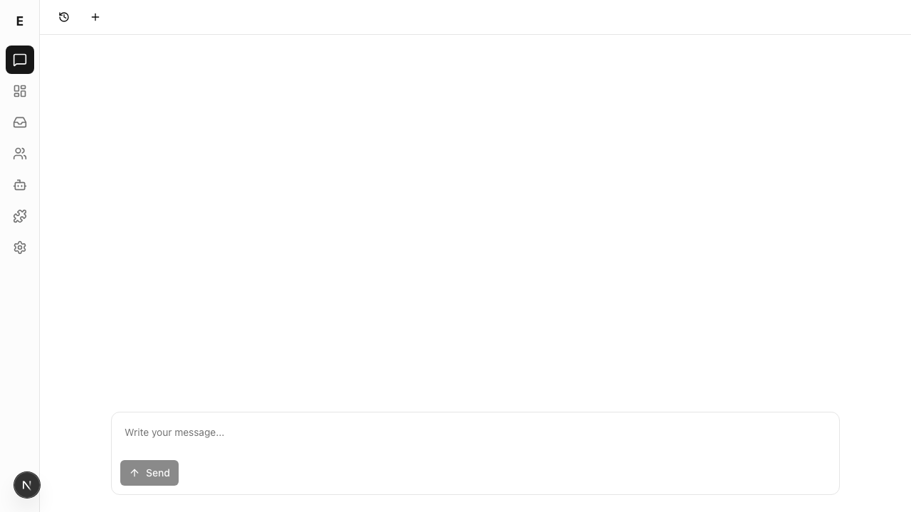
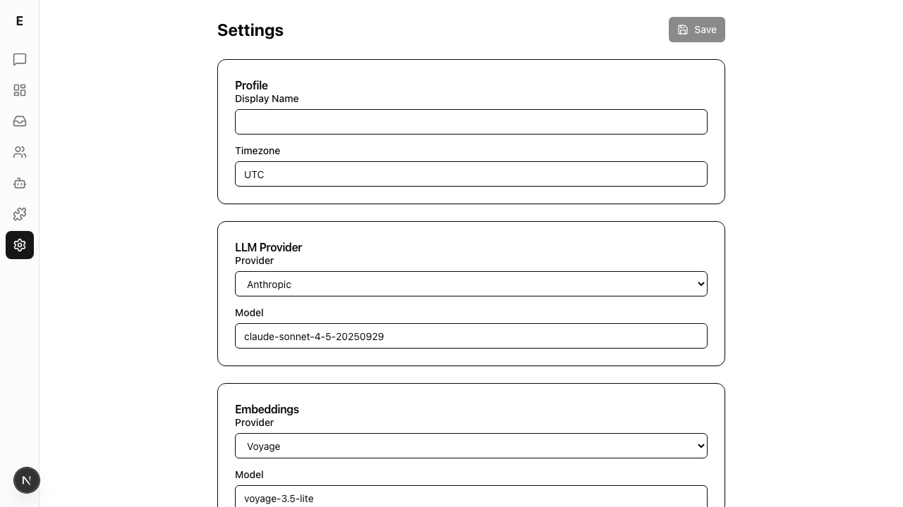
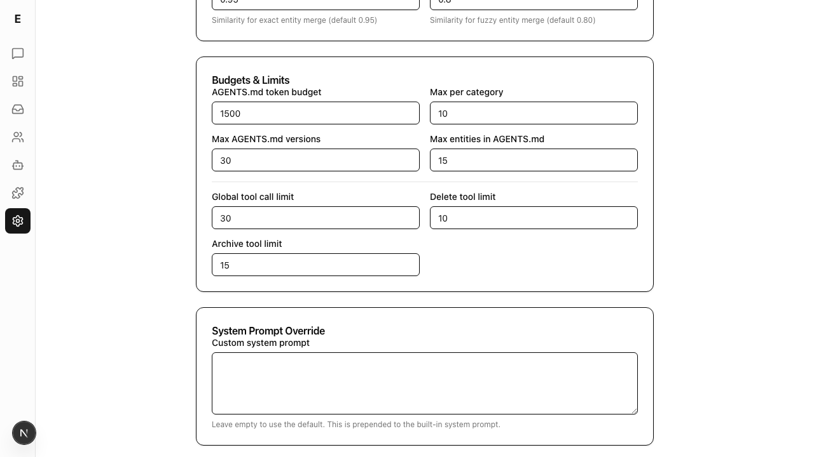
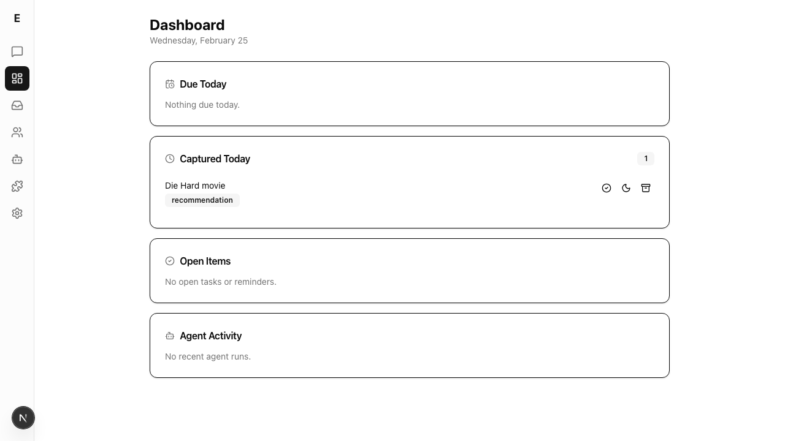
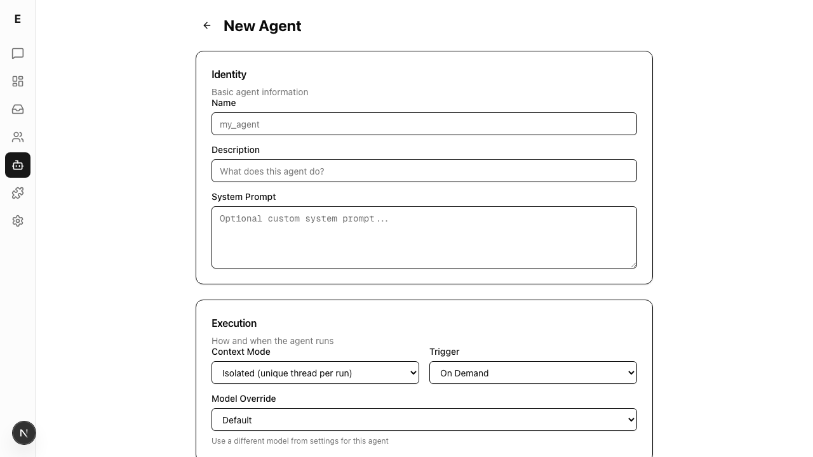
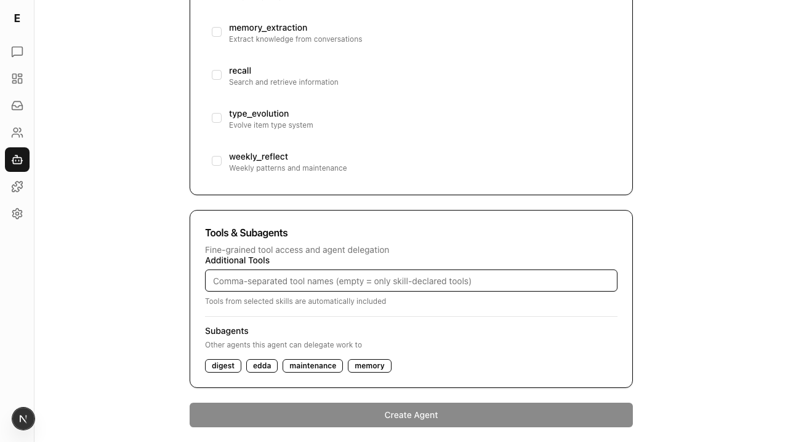
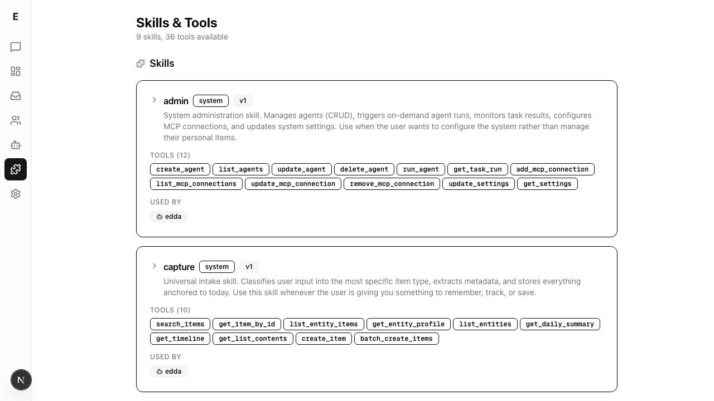

# Dogfood Report: Edda

| Field | Value |
|-------|-------|
| **Date** | 2026-02-25 |
| **App URL** | http://localhost:3000 |
| **Session** | edda-dogfood |
| **Scope** | Full app UX exploration — navigation, layout, structure, interactions |

## Summary

| Severity | Count |
|----------|-------|
| Critical | 0 |
| High | 2 |
| Medium | 4 |
| Low | 3 |
| **Total** | **9** |

## Issues

### ~~ISSUE-001: Agent detail page crashes — "column notify does not exist"~~ RESOLVED

> This issue was fixed during the session. The agent detail page now loads correctly with Overview, Schedules, and Runs tabs.

---

### ISSUE-002: Sidebar navigation has no labels — icon-only with no tooltips

| Field | Value |
|-------|-------|
| **Severity** | high |
| **Category** | ux |
| **URL** | http://localhost:3000 |
| **Repro Video** | N/A |

**Description**

The left sidebar navigation uses icon-only buttons with no text labels and no tooltips on hover. For a new user, it's impossible to know what each icon does without clicking every one. The icons are small (roughly 24px) generic outlines that aren't universally recognizable. There's no onboarding or help to explain the navigation.

The sidebar also has no visual grouping — 7 nav items are stacked vertically with identical spacing, making it hard to scan. The "E" logo at top and "N" avatar at bottom are also unlabeled.

**Repro Steps**

1. Navigate to http://localhost:3000
   

2. **Observe:** The sidebar shows 7 icons with no text labels or tooltips. A new user cannot determine what each icon does without trial and error.

---

### ISSUE-003: Page scrolling broken — `scroll down` doesn't work on any page

| Field | Value |
|-------|-------|
| **Severity** | medium |
| **Category** | ux |
| **URL** | http://localhost:3000/settings |
| **Repro Video** | N/A |

**Description**

The app uses `overflow-auto` on an inner `div.flex-1` container instead of native document scrolling. This means standard scroll behavior (scroll wheel on the page body, keyboard Page Down, etc.) may not work if the inner container isn't focused. The `agent-browser scroll down` command had no effect on any page — the scrollable container is nested inside a flex layout, not the document root.

While this may work fine with mouse scroll directly over content, it breaks expectations for programmatic scroll and potentially for keyboard-only navigation.

**Repro Steps**

1. Navigate to http://localhost:3000/settings
   

2. The page has extensive content below the fold (Web Search, Agents & Concurrency, Approval Modes, Deduplication Thresholds, Budgets & Limits, System Prompt Override)

3. **Observe:** Native document scroll returns `scrollTop=0`. Only scrolling the inner `.flex-1.overflow-auto` div works.

---

### ISSUE-004: Settings page is an overwhelming flat list with no navigation

| Field | Value |
|-------|-------|
| **Severity** | high |
| **Category** | ux |
| **URL** | http://localhost:3000/settings |
| **Repro Video** | N/A |

**Description**

The Settings page has 8 sections with 30+ fields in a single long scrolling page: Profile, LLM Provider, Embeddings, Web Search, Agents & Concurrency, Approval Modes, Deduplication Thresholds, Budgets & Limits, and System Prompt Override.

There's no sidebar navigation, no collapsible sections, no tabs, and no search. Users must scroll through the entire page to find a specific setting. The "Save" button is at the top right and scrolls off-screen — users editing settings at the bottom have no visible save action.

Advanced settings (deduplication thresholds, AGENTS.md token budgets, tool call limits) are mixed in with basic settings (display name, timezone) with no visual hierarchy distinguishing them.

**Repro Steps**

1. Navigate to http://localhost:3000/settings
   

2. Scroll to the bottom
   

3. **Observe:** 30+ fields in a flat list, no section navigation, Save button not visible when editing bottom fields.

---

### ISSUE-005: Console errors on every page — backend connection refused

| Field | Value |
|-------|-------|
| **Severity** | medium |
| **Category** | console |
| **URL** | http://localhost:3000 |
| **Repro Video** | N/A |

**Description**

Multiple `ERR_CONNECTION_REFUSED` errors appear in the console on page load. While this is expected when the backend server isn't running, the frontend doesn't gracefully handle this. The chat page shows no indication that the backend is unavailable — the input field and Send button are present as if everything is working. Only the thread history panel shows an error ("Failed to load threads").

The app should detect backend unavailability and show a clear banner or status indicator, rather than silently failing on API calls.

**Repro Steps**

1. Navigate to http://localhost:3000, open browser console
   

2. **Observe:** Console shows `Failed to load resource: net::ERR_CONNECTION_REFUSED` errors. No visible indication in the main UI that the backend is down.

---

### ISSUE-006: Chat page is empty and intimidating — no onboarding or guidance

| Field | Value |
|-------|-------|
| **Severity** | medium |
| **Category** | ux |
| **URL** | http://localhost:3000 |
| **Repro Video** | N/A |

**Description**

The default landing page (Chat) shows a large empty white area with just "Write your message..." at the bottom. For a new user, there's no:
- Welcome message or introduction to Edda
- Suggested prompts or example queries
- Explanation of what the agent can do
- Getting started guide
- Visual indication of the app's capabilities

Compare to ChatGPT, Claude, or similar apps that show suggested prompts, capability cards, or a welcome flow. The empty state communicates nothing about the product.

**Repro Steps**

1. Navigate to http://localhost:3000
   

2. **Observe:** Completely blank page with only a text input at the bottom. No guidance for new users.

---

### ISSUE-007: Dashboard cards have no click-through or expansion

| Field | Value |
|-------|-------|
| **Severity** | low |
| **Category** | ux |
| **URL** | http://localhost:3000/dashboard |
| **Repro Video** | N/A |

**Description**

The Dashboard shows 4 cards (Due Today, Captured Today, Open Items, Agent Activity). The "Captured Today" card shows an item ("Die Hard movie" with type "recommendation") with action buttons (complete, snooze, archive). However:
- The item itself is not clickable to view details
- Empty state cards ("Nothing due today", "No open tasks or reminders", "No recent agent runs") have no calls to action
- There's no way to navigate from empty dashboard cards to create content or view related pages

The dashboard is read-only with no drill-down capability.

**Repro Steps**

1. Navigate to http://localhost:3000/dashboard
   

2. **Observe:** Cards display data but items aren't clickable for detail views. Empty states have no actionable links.

---

### ISSUE-008: New Agent form has "my_agent" as default name placeholder value

| Field | Value |
|-------|-------|
| **Severity** | low |
| **Category** | ux |
| **URL** | http://localhost:3000/agents/new |
| **Repro Video** | N/A |

**Description**

The "New Agent" form pre-fills the Name field with "my_agent" as an actual value (not placeholder text). This means a user who doesn't change it will create an agent named "my_agent". This should either be empty with a placeholder, or use a more descriptive default. The snake_case format also assumes technical users — a more approachable default would be better.

**Repro Steps**

1. Navigate to http://localhost:3000/agents and click "New Agent"
   

2. **Observe:** Name field is pre-filled with "my_agent" as an actual value.

---

### ISSUE-009: Subagents section in New Agent form is confusing

| Field | Value |
|-------|-------|
| **Severity** | low |
| **Category** | ux |
| **URL** | http://localhost:3000/agents/new |
| **Repro Video** | N/A |

**Description**

The "Tools & Subagents" section at the bottom of the New Agent form shows existing agents (digest, edda, maintenance, memory) as toggle buttons for "Subagents — Other agents this agent can delegate work to". There's no explanation of what delegation means, how it works, or why you'd want it. The buttons appear unselected but there's no visual distinction between selected/unselected states. This is an advanced concept presented without context.

**Repro Steps**

1. Navigate to http://localhost:3000/agents/new and scroll to bottom
   

2. **Observe:** Subagent buttons shown with no explanation of delegation. Selected/unselected state unclear.

---

### ISSUE-010: Skills & Tools page — type_evolution description truncated

| Field | Value |
|-------|-------|
| **Severity** | medium |
| **Category** | content |
| **URL** | http://localhost:3000/skills-tools |
| **Repro Video** | N/A |

**Description**

In the Skills & Tools page, the `type_evolution` skill card has its description truncated mid-sentence: `Evolves the type system based on usage patterns. Runs as a cron job. Clusters unclassified "` — the text is cut off with a dangling quote. The button's accessible label in the DOM also shows this truncation. This suggests a text overflow issue or a description that contains unescaped quotes breaking the rendering.

**Repro Steps**

1. Navigate to http://localhost:3000/skills-tools
   

2. **Observe:** The type_evolution card description is cut off at `Clusters unclassified "`.

---

## UX Recommendations (Beyond Issues)

Based on the full exploration, here are structural UX improvements:

1. **Add sidebar labels or tooltips** — At minimum, show text labels on hover. Ideally, allow an expanded sidebar mode with text labels visible. The icon-only sidebar is a power-user optimization that hurts discoverability.

2. **Add a welcome/onboarding flow** — First-time users need context. Show suggested prompts on the empty chat page, explain what Edda can do, and guide users through key features.

3. **Restructure Settings into tabs or sections** — Group settings into tabs (General, AI Models, Agent Behavior, Advanced) with a sticky Save button. Hide advanced settings behind an expandable section.

4. **Make Dashboard cards actionable** — Items should be clickable to view/edit details. Empty states should have CTAs ("Start a conversation to capture items", "Create an agent to automate tasks").

5. **Add a status indicator for backend connectivity** — Show a clear banner when the server is unreachable instead of silently failing.

6. **Add breadcrumbs or page titles consistently** — Some pages have titles (Dashboard, Inbox, Entities, Agents, Settings), but the Chat page has none. Navigation context is inconsistent.

7. **Improve the agent detail/edit experience** — Once the crash is fixed, the agent detail page should show run history, schedule details, and allow inline editing.

8. **Add keyboard shortcuts** — Power users would benefit from Cmd+K search, Cmd+N for new chat, etc.
